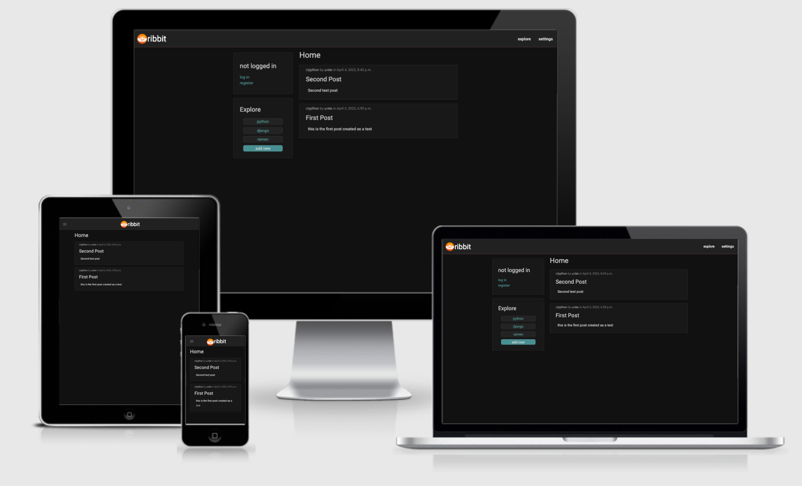
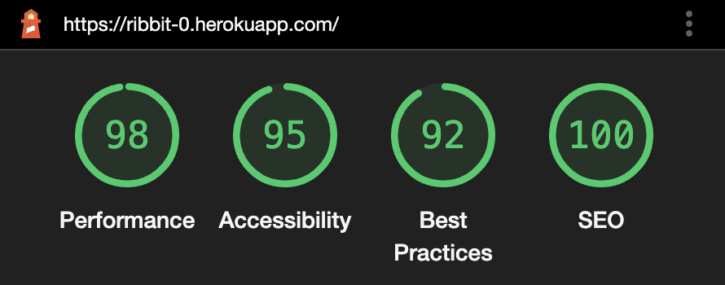

# ribbit

Welcome to Ribbit! This is a gathering place. A forum where users can write about their favourite topics and their knowledge with the world. Users can create categories, posts and like and comment on other people's posts. Ribbit is a space to share and respect among the community is expected, there is a 0 tolerance to hatred policy.

Open the project deployed to Heroku [here](https://ribbit-0.herokuapp.com/).

---

## Contents

- [User Experience](#user-experience)
- [Design](#design)
- [Database Design](#database-design)
- [Technologies Used](#technologies-used)
- [Deployment](#deployment)
- [Testing](#testing)
- [Credits](#credits)

---

## User Experience

### Initial Discussion

* I wanted to create a community portal linked to a database to allows users to register, log in, create a profile, create categories, posts and like and comment on other people's posts.
* As a barebones version of a platform like Reddit, I named this tool Ribbit and had a frog for its logo.
* I wanted admins to have special permissions through the admin portal like deleting any database entry for posts, likes, comments, categories, users and profiles

### User Stories

| **User Story Id** | **As a / an...** | **I should be able to...** | **So that I can...** |
| --- | --- | --- | --- |
||| **VIEWS AND NAVIGATION** ||
| G1 | User | View homepage with all posts | to find posts that I may like to read |
| G1 | User | Filter posts by categories | have quicker access to the information I value most |
| G1 | User | View a list of categories | understand what topics exist |
| G1 | User | Open a post | view the whole contents and any related comments |
| G1 | User | Filter posts by categories | have quicker access to the information I value most |
||| **USER ACCOUNTS** ||
| R1 | User | Register to Ribbit | have access to more features |
| R1 | Registered User | Access account settings | change my username or profile picture |
||| **POSTING AND EXPLORING** ||
| P1 | Registered User | Create new categories | that match my interests |
| P1 | Registered User | Create new posts | so I can share my knowledge with the internet |
| P1 | Registered User | Comment on existing posts | show my opinion on other user's posts |
| P1 | Registered User | Like other posts | to show the post author my appreciation |
||| **ADMIN** ||
| A1 | Admin | Modify or delete any database entry | keep an organised environment |

### Project Goals

- The mail purpose of this website is for users to be able to chat about their favourite topics in a way that's organic and feels natural to them.
- This project also demonstrates my skillset, build a front-end system that's clean and usable a back-end that's scalable and modular, and a database management system with full CRUD (Create, Read, Update and Delete) functionality, using a PostgreSQL and Cloudinary.

---

## Design

### Wireframes
See the [wireframes pdf file](media/readme/wireframes.pdf)

### Color Scheme

- The main colors used in this site are shades of grey for physical elements, teals to highlight certain interactable elements and orange for the logo.

### Fonts

- Main font is Roboto and sans-serif fonts in case of fallback. Sans-serif font are easier to read for dyslexic and partially visually impaired users.
- As the standard HTML font size is 16px, I kept it at that, ensuring to not have any fonts smaller than that, to aid visually impaired users.
- Also, the recommended smallest font size for accessible websites is 12px, so by keeping all font sizes at the HTML standard of 16px or above, I ensured to be fully compliant with the [Penn State University Accessibility and Usability Guidelines](https://accessibility.psu.edu/fontsizehtml/).
- Font sizes are also able to be zoomed to 200% without losing contrast or functionality, to comply with the [WCAG Guidelines on fonts](https://www.w3.org/TR/UNDERSTANDING-WCAG20/visual-audio-contrast-scale.html).

### Images

- [Logo](static/images/ribbit-logo.png) by Khalanar

### Wireframes

- [Wireframes for desktop, mobile, and tablet for this project](static/docs/wireframes.pdf).

### Features

#### Register

- This feature allows the user to register as a user and create an account (user profile). 
- In this version, user profiles are used to set the name and profile picture of the account

#### Login / Logout
- Allows users to log in and out of the game. Certain actions are locked behind accounts:
  - Edit user profile
  - Create categories
  - Create posts
  - Leave comments on posts
  - like posts 

#### Post
- Users can create posts and tie them up to a category to keep them organised.
- In this version text is supported as the media
- An excerpt of a post can be viewed in the homepage and in category pages
- Users can view the full post under the post screen

#### Comment Posts
- Users can leave comments on posts.
- In this version text is supported as the media

#### Like Posts
- Users can like other user posts

#### Create Categories
- Users can create categories to keep posts organised
- Users can filter all posts by their categories

### Future Versions

- Allow images in posts
- Implement Light mode, selectable from the user profile settings
- Allow users to reset their password from the user profile settings
- Create page for users at /u/username with a list of their posts
- Allow users to follow other users
- Allow users to favourite other users' posts
- Allow users to follow categories
- Allow users to like comments 

### Defensive Design

- Form validation
  - This has been used on every form input on the site to ensure the correct data is added
  - If incorrect data is added, red warning text appears, to instruct the user on how to fix the error
- Messages when an action is completed
    - User registration
    - User login
    - User logout
    - User name edited under settings
    - User profile picture edited under settings
    - Post successfully created
    - Comment successfully created
- Default image
  - A default profile image is displayed if none is uploaded
- Custom error pages
  - A custom 404 error page will show if the user attempts to visit a page that doesn't exist
  - A custom 500 error page will show if an internal server error occurs

---

## Database Design

This database uses a SQL database through PostgreSQL. 

### Models
#### Category
|Field Name | Field Type |
| --- | --- |
| name | CharField, max_length 12, unique |

#### Post
|Field Name | Field Type |
| --- | --- |
| title | CharField, max_length 100, unique |
| slug | SlugField, gets lowercase title and replaces spaces with dashes |
| content  models.TextField() |
| featured_image | CloudinaryField Image |
| excerpt | TextField(blank=True) |
| category | Category ForeignKey |
| author | User ForeignKey |
| date_created | DateTimeField |
| date_modified | DateTimeField |
| likes | User ForeignKey ManyToManyField |

### Comment
|Field Name | Field Type |
| --- | --- |
| post | Post ForeignKey |
| author | User ForeignKey |
| body | TextField |

### Profile
|Field Name | Field Type |
| --- | --- |
| user | User ForeignKey OneToOneField |
| name | CharField |
| dark_mode | BooleanField |
| profile_picture | CloudinaryField Image |
| favorite_categories | Category ForeignKey ManyToMany |
| saved_posts | Post ForeignKey ManyToMany |

---

## Technologies Used
- HTML5
- CSS
- Materialize CSS
- JavaScript
- Python
- Django
- SQL

### Workspace and tools

- [GitPod](https://gitpod.io/) was used as a virtual IDE workspace to build this site.
- [Git](https://git-scm.com/) was used for version control by utilising the Gitpod terminal to add and commit to Git and push to GitHub.
- [GitHub](https://github.com/) is used to store the code for this project after being pushed from Git.
- [Affinity Designer](https://affinity.serif.com/en-gb/designer/) was used to create the wireframes during the design process.
- [Am I Responsive](http://ami.responsivedesign.is/#) was used to check the responsive design of the site, and to create the final site image.
- [Responsinator](http://www.responsinator.com/) was used to help improve the responsive design on a variety of devices.
- [Google Fonts](https://fonts.google.com/) was used to select all the fonts on the site.

### Installed Packages*

| Name | Use case |
|------|---------|
| Django | Framework |
| django-allauth | Authentication |
| gunicorn | WSGI HTTP Server |
| django-crispy-forms | Front End Form Rendering |
| crispy-forms-materialize | Module to add materializecss styles to crispy forms |
| dj-database-url | Database Configuration |
| psycopg2 | PostgreSQL DB manager |
| coverage | Test Coverage |
| cloudinary | Library to manage cloudinary files and types |

*only installed packages not including dependencies

### Hosting

#### Heroku

[Heroku](https://www.heroku.com) was used to deploy the live site.

#### Cloudinary

[Cloudinary](https://cloudinary.com) was used to host this project's media and static files.

---

## Deployment

Deployed to Heroku, view [deployment](static/docs/deplyoment.md) for details.

---

## Testing

### Manual Testing

| What | Where | Test result |
|----|-----|-----|
| HTML | [Validator W3C Markup validation service](https://validator.w3.org/) | 0 errors - warnings found as linter cannot process templating |
| CSS | [Jigsaw W3C CSS validation service](https://jigsaw.w3.org/css-validator/validator) | 0 errors - 0 warnings  |
| JS | [JSHint](https://jshint.com/) | Ignored warning about materializecss variables and arrow functions |
| Python | Automatic Testing | 80% total coverage. Manually tested data validation on inputs |
|  | ribbit/settings.py | Ignored 5 long-line lint errors as I think having these in 2 lines actually would impede readibility |
|  | ribbit/urls.py | No errors |
|  | ribbit/wsgi.py | No errors |
|  | wall/admin.py | No errors |
|  | wall/apps.py | No errors |
|  | wall/models.py | No errors |
|  | wall/test_forms.py | No errors |
|  | wall/test_models.py | No errors |
|  | wall/test_views.py | No errors |
|  | wall/tests.py | No errors |
|  | wall/urls.py | No errors |
|  | wall/views.py | Ignored 2 long-line lint errors as I think having these in 2 lines actually would impede readibility  |
|  | manage.py | No errors |
|  | FILENAME | No errors |
|  | FILENAME | No errors |

### Data validation
Manually tested all input fields and urls

### Responsiveness
- Responsiveness was checked through[Am I Responsive](http://ami.responsivedesign.is/) 

### Accessibility 
- Accessibility report by [Google Lighthouse](https://developers.google.com/web/tools/lighthouse)

### Known issues
- None found, if any errors are found, please contact me via my GitHub ([Khalanar](https://github.com/khalanar/)) to get them fixed.

---

## Credits

### Code
* [Materialize CSS](https://materializecss.com): Library of icons used for social media and download links.
* [Django Documentation](https://docs.djangoproject.com/en/3.2/) has been used to ensure correct syntax usage throughout the code.

### Content

* All content created by [Khalanar](https://github.com/klahanar).

### Media

* All media on this site is owned by [Khalanar](https://github.com/klahanar)

### Acknowledgements

* My mentor, Antonio Rodriguez, at [Code Institute](https://codeinstitute.net/), for continuous helpful feedback and support.
* The team at [Code Institute](https://codeinstitute.net/), for teaching me the necessary skills to create this site.